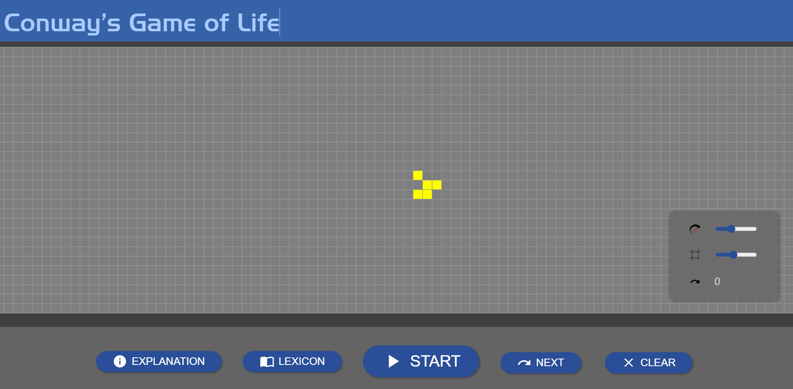
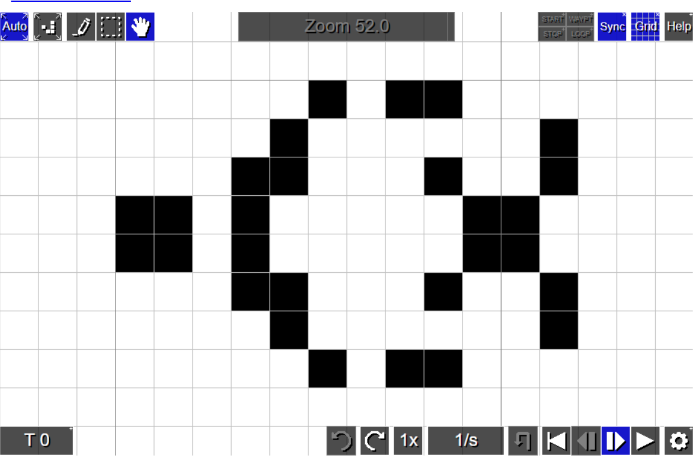

# Cell Society Design Plan
### Team Number: 3
### Names: Philip Lee (kl445), Saad Hakim (sh604), Abhishek Chataut (ac802)


## Overview
We are making a cellular automata grid simulation that can be configured in many different ways 
based on a configuration file. It will render the simulation and be able to run it multiple ways.

## User Interface
Users will be able to see a grid with colored-cells representing a state (alive/dead).
Additionally, a control overlay/panel will be avaliable with buttons for users to interact with the model.
For instance, reset buttons, speed up buttons, and pause buttons will be displayed.
Error messages will also be shown if there are bad input data or empty data, and etcetera to handle
input errors.

Here is an example of a UI:



taken from [a game of life simulator](https://playgameoflife.com/).

Here is another example of a UI that we are considering:



taken from [another game of life simulator](https://conwaylife.com/).

## Configuration File Format
* XML File data
  * simulation data (e.g., Game of Life, Fire)
  * title
  * authors
  * description
  * grid dimensions
  * initial cell states
  * specific simulation parameters.
```xml
<simulation>
    <model>
        <type>Game of Life</type>
        <parameters>
            <!-- Add specific simulation parameters here -->
        </parameters>
    </model>
  <title>Game of Life Simulation</title>
  <authors>Team 3 Names</authors>
  <description>Originally by Conway</description>
  <gridDimensions>
    <width>10</width>
    <height>10</height>
  </gridDimensions>
    <gridMap>
        <entry>
            <coordinate>
                <x>0</x>
                <y>0</y>
            </coordinate>
            <value>1</value>
        </entry>
        <entry>
            <coordinate>
                <x>1</x>
                <y>2</y>
            </coordinate>
            <value>1</value>
        </entry>
    </gridMap>
</simulation>
```
```xml
<simulation>
<model>
    <type>Spreading Fire</type>
    <parameters>
        <!-- Add specific simulation parameters here -->
    </parameters>
</model>
<title>Fire Simulation</title>
<authors>Team 3 Names</authors>
<description>Model for Forest Fires</description>
<gridDimensions>
    <width>20</width>
    <height>20</height>
</gridDimensions>
<gridMap>
    <entry>
        <coordinate>
            <x>10</x>
            <y>10</y>
        </coordinate>
        <value>1</value>
    </entry>
</gridMap>
</simulation>
```


## Design Overview and Details
##### Package Display_and_Contol
* Display
- Manages the scene creation and maintenance
- Shows the grid and its color changes

* Control
- Implements Start, Pause, Speed, Save, Edit, and Reset functionality


##### Package Model
* Grid
- Implements the grid(s)
- Handles behavior of what how it affects neighbors

* Cell
- Keep track of the state of the cell and its neighbors
- Updates the state of the cell


##### Package Config
* Config (Abstract class)
- Manages the reading of the files
- Each subclass be a type of simulation
- Ensures all specifications in XML is implemented


#### CRC Cards
| Display                            |         |
|------------------------------------|---------|
| void renderGrid(Cell[][] nextGrid) | Cell    |
| void renderControlOverlay()        | Control |
| void updateControlOverlay()        |         |
|                                    |         |


| Control                                                                                   |         |
|-------------------------------------------------------------------------------------------|---------|
| void start()                                                                              | Cell    |
| void pause()                                                                              | Display |
| void reset ()                                                                             |         |
| void save ()                                                                              |         |
| void edit (String fileName, String fileLocation, String fileAuthor, String fileDescription |         |

| Grid                                 |      |
|--------------------------------------|------|
| Cell[][] updateGrid()                | Cell |
|                |      |

| Config                        |          |
|-------------------------------|----------|
| void loadXMLFile(String path) |          |
| void saveXMLFile(String path) |          |
| void editParameter()          |          |

## Use Cases
##### Apply the rules to a middle cell
* call the getNeighbors method in the Cell class
* call the updateState method in the Cell class

##### Apply the rules to an edge class
* call the getNeighbors method in the Cell class -- if a cell is an edge cell the neighbors
that are beyond the edge are considered as empty cells
* call the updateState method in the Cell class

##### Move to the next generation
* call the updateGrid method from the Grid class
  - create a two-dimensional array
  - call the updateCell from the Cell class on each cell
  - copy the updated cell to the new array
* call renderGrid with the new grid as a parameter from the Display class

##### Switch simulations
* call useSimulationState from Config class
  - call the loadXMLFile from the Config class with the new data
  - call updateGrid from Grid class with the data loaded from the XML file to update grid 
    - create a two-dimensional array
    - call the updateCell from the Cell class on each cell
    - copy the updated cell to the new array
  - call renderGrid with the new grid as a parameter from the Display class

##### Set a simulation parameter
* call editParameter from Config class


##### Save the file
* In the Display, a button will be displayed to save the current state to an XML file.
* This causes a call to the Control, which will then make a call to config.
* A call to config is made to save the current state of the display.
* Config will implement saveXMLFile and save the file into a specific path to the computer.

##### Pause the simulation
* In the Display, a button will be displayed to pause the current state of the model.
* Once the button is clicked, a call to Control's pause() will then stop the tick
in order to stop any new generations of the grid.

##### renderGrid
* loop through the provided grid from model
  * render each cell as rect with a color based on the Cell object

##### renderControlOverlay
* render the control overlay with buttons for start, pause, reset, save, edit, and speed up/down
* attach each button with its event handler

##### Reset Grid
* We have kept a copy of the original configuration of the grid the first time that we loaded
the XML file
* call reset method from Control class that would in turn call renderGrid() from Display with
the original grid

##### Edit Simulation Save
* call the edit method the save method from the Control class with the relevant information and the XML file 
passed as parameter.
  - The edit method will then update those information in the XML file before returning to
  the save method

## Design Considerations
* If we need a Cell class or not
  * A Cell class can help reduce logic in Grid or other class and keep information and rules about how it will update contained
  * A problem is it might need some sort of information on how it is rendered, but that would no longer follow Model View Seperation
  * It might also need subclasses because there are multiple types of cells for different simulations
  * A Game of Life cell can only be used for Game of Life, so maybe the Cell classes should be based on or inherit from simulation classes

* Data structure for Grid
  * We can use a character or an integer array to handle the initialization of the starting grid.
  * After each tick, once the grid is modified, we can generate another char/integer array so that it can be displayed.
  * In order to modify the actual grids, we can go through cells, stored in an adjacency list data structure, to only check if
  its eight closest neighbors would change that cell's state. 
  * This can be done by hashing the cell's (i, j) index against a list of its closest neighbors (with length of map[(i, j)] where 0 <= length <= 8)
  to account for edge cases where there is no available neighbors in a certain direction.
  * The actual modification can vary according to the game variation the program is modelling.
  
## Team Responsibilities
 * Team Member #1: Abhishek
   * Primary: View/Display 
     * Secondary: Grid/Control

 * Team Member #2: Philip
   * Primary: Grid/Cell
     * Secondary: Config

 * Team Member #3: Saad
   * Primary: Config
     * Secondary: View/Display/Control

     
## Timeline:
   * Tuesday, 1/30: Basic functionality within each package
     - Meeting to address the next steps
     - Code review for refactoring and communication for cross-class interactions.
   * Monday, 2/3: Basic package inter-functionality, and finish XML files for other variations
     - Meeting to address the next steps
     - Code review for refactoring.
  * Tuesday, 2/6: Discuss refactoring and code review, implement other extensions/variants
  * Saturday, 2/10: Finalizing, bug testing, debugging, adding documentation
  * Monday, 2/12: Deadline
     
